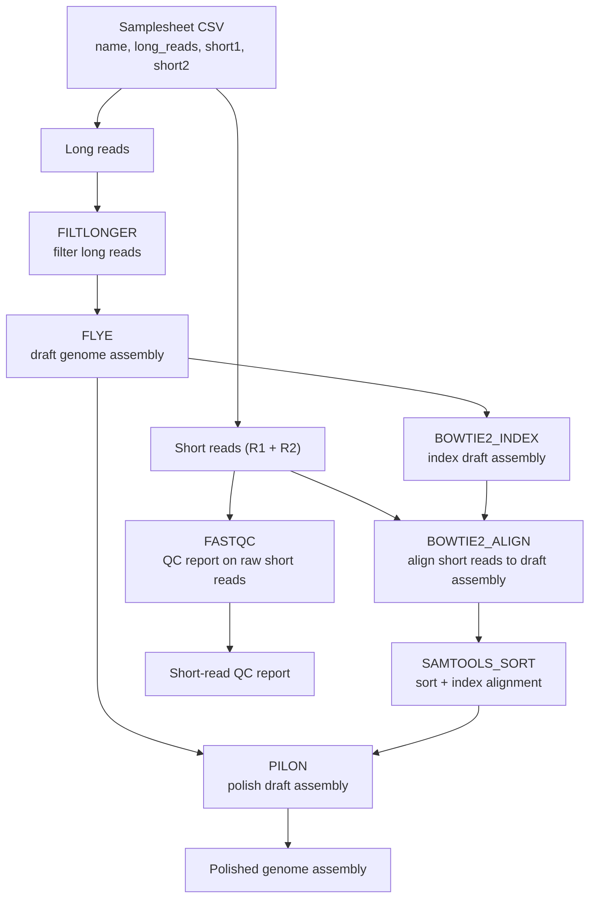

# Week 2 - Modularizing our pipeline and polishing our assembly

You may have noticed from the first week that our pipeline is becoming
increasingly complex and slightly onerous to read in a single file. In this
week, we are going to refactor our workflow to make it more modular and
easier to read. This modularity will have the secondary benefit of enabling
us to reuse components of the pipeline in future projects or even share them
with others.

From a bioinformatics standpoint, this week we will add several steps to our
pipeline. We will first generate a genome index from the assembly and align
the illumina reads to the draft assembly using bowtie2. We can then sort the
aligned reads and provide them to Pilon to polish the assembly and fix any
potential errors.

## Diagram of our pipeline



## Relevant Resources

- Requesting SCC Resources
- Nextflow Modules
- Nextflow Features

## Objectives

For this week, you will again be given a working pipeline but this time, I
will ask you to focus on connecting the processes by filling out the
nextflow workflow. You will need to look at the inputs and outputs of the
processes, and connect them appropriately.

## Setting up

1. Clone the github repo for this project - you may find the link on
blackboard

## Tasks

### Always confirm your workflow with a `-stub` run first

Last week you confirmed your channel wiring was correct by running
`nextflow run week1.nf -stub` instead of building conda environments and
executing every tool for real. We'll continue that same habit this week: as
you modularize and connect the processes below, verify each change with

```bash
nextflow run week2.nf -stub
```

A `-stub` run executes each process's `stub:` block (the placeholder
`touch` commands) instead of its real `script:` block, so it finishes
almost instantly and doesn't require building conda environments or
submitting a single job to the SCC. That means a successful stub run only
tells you that your channels and processes are wired together correctly and
producing outputs named the way downstream steps expect - it does **not**
confirm that your real commands, resource labels, or conda environments are
correct.

If you look in the `nextflow.config` file, you'll notice that we also have
`conda` and `cluster` profiles defined, corresponding to the SCC and the
qsub-based job submission we discussed in lab. This week's processes are
significantly more resource intensive than last week's, so once you are
confident your pipeline is wired correctly via repeated `-stub` runs, you would run for real with:

```bash
nextflow run week2.nf -profile cluster,conda
```

**Only use this when asked - this is just an example**

This submits each process as a separate job to the SCC and may take
considerably longer as jobs wait in the queue. For this week's tasks,
however, you should not need to leave `-stub` mode - the resource report you
need for the labeling section below has already been generated for you.

### Modularize the remaining processes in the week2.nf

Before you begin, take note of the `week2.nf` file you've been provided and
the `modules/` directory. If you've been following along, you'll notice that
we've changed how we have organized our pipeline. The same code from our
week 1 pipeline is there, but we have now separated each process into a
different module located in a named directory in `modules/`. This allows us
to remove the processes from the `week2.nf` file and import them into the
`week2.nf` file using the `include` keyword. You can think of this as akin
to when you import a library in python to make certain functions available
for use.

1. Take the code for the processes `BOWTIE2_INDEX`, `BOWTIE2_ALIGN`,
`SAMTOOLS_SORT`, and `PILON` found in the `week2.nf` and separate them out
into modules the way I have already done for you with last week's code. You
should remove this code from the `week2.nf` file and place them in new text
files following the same format as last week's modules. When finished, your
`week2.nf` should begin with the `include` statements and end with the
workflow block.

2. Follow the same pattern where you make a new directory in `modules/`
with the name of the process and the file itself called `main.nf`.

3. Just as I've done for you with last week's processes, at the top of your
`week2.nf` file before the workflow block, you should use the `include`
keyword to import the processes you have created new modules for. Follow
the same syntax and style that is already there.

### Connect the processes in the week2.nf

1. Look at the inputs and outputs of each module and try to construct the
workflow by passing the correct channels to each process. You will need to
understand the order of operations and the dependencies between the
processes to construct the workflow. If you find it useful, refer to the
`specifications.md`. You should add the processes to the workflow in the order
they should be run and with the right dependencies. A dependency in this context
is simply a process that must be run and finish before the next process can
begin.

If you complete this successfully, you should have a working pipeline that
should run last week's tasks as well as the steps from this week that will
assemble the reads, align the short reads to the assembly, sort the
alignments, and use the short reads to polish the assembly.

You'll notice that when we go to align reads to the reference sequence, we
first have to build an index. We will discuss more in-class about this
step, but essentially, most aligners need to build a data structure that
allows them to quickly and efficiently align reads to the reference
sequence and locate where they align. You can think of a genome index as
akin to a table of contents, which allows you to determine what page a
chapter is located on, without having to read through the entire book. Most
traditional aligners will need to build an index for the reference sequence
before they can align reads to it, and most indexes need to be built with
the same tool as the aligner.

Before you run the pipeline, please complete the following section.

### Use the report and the list of SCC resources to give each process an appropriate label

In the repo, I have provided you a HTML report that was obtained by running
nextflow for real with the `-with-report` flag:

```bash
nextflow run week2.nf -profile cluster,conda -with-report
```

You will not need to run this command yourself - the report is already
included in the repo. This report shows you the amount of resources used
per process. Use this information and the guide for requesting SCC
resources to give each process an appropriate label.

1. Look at the report and try to give each process an appropriate label.
Focus on the amount of VMEM (virtual memory) required for each task and
ensure that your label requests the appropriate amount of RAM. You want to
look at the virtual memory usage tab of the memory section in the report.

2. Edit your `nextflow.config` to add the appropriate label specifications.
I have provided you a sample label in the config file that you can use as a
model for the ones you create. Please create labels called `process_low`,
and `process_medium` that specify a different number of CPUs to request.

You can see an example of where I've added a label to a process in the
`FLYE` process. You'll also notice that in the command, I have to specify
the option specific to FLYE for using multiple threads, `-t`, and I use the
`$task.cpus` variable in nextflow to automatically fill in the number of
cpus requested for the selected label. If you look in the
`nextflow.config`, you can see that the label `process_high` requests 16
cpus, which also reserves 128GB of memory.

3. For the other processes, please specify an appropriate label like in the
`FLYE` process and ensure you add the right flag to each command to make
use of the resources requested. You will need to use the `$task.cpus`
variable in nextflow to automatically fill in the number of cpus requested
for the selected label in the command as well as find the right flag to use
for each tool by looking at their documentation.

4. Certain processes like building an index or aligning reads to the
reference benefit greatly from using multiple threads / cores. You can use
a higher number of threads / cores for these processes if you have the
resources available and it will greatly speed up the process. You may
choose to use a greater number of threads for these processes even if you
don't technically need more memory reserved.

5. Some tools may not be able to use multiple threads / cores, but you
should still use the provided report to specify an appropriate label so
that your job properly reserves the right amount of memory.

## Week 2 Recap

- [ ] Modularize the remaining processes in the week2.nf
- [ ] Connect the processes in the week2.nf
- [ ] Create labels in your nextflow.config for `process_low` and
`process_medium`
- [ ] Use the report and the list of SCC resources to give each process an
appropriate label - ensuring that each process has requested a node with
enough memory
- [ ] Run the pipeline with `-stub` and confirm it completes successfully
